# Happy Travels appointment booking service

HappyTravels appointment booking service is a web based booking application to allow users to book appointments in a local travel agency. The users are given the possibility to make an account, create a booking, and then edit or delete their bookings. This site  was developed using Python (Django), HTML, CSS and by storing the data in a PostgreSQL database.

<!-- Add live link -->
[Live Website](https://happy-travels-appt-booking-469f488c0638.herokuapp.com/)

<!-- Add responsive mockup -->

## User Goals and Stories

### User goals
- As a user I want to
  - easily and intuitively navigate throughout the website
  - browse the website naturally and with ease
  - be able to view the website and read all information on all screen sizes
  - Create an account on the website
  - Make an appointment at my preferred time and date
  - Manage my appointments and change and delete them if needed

### Business owner goals
- As the website business owner I want to 
  - As the website business owner I want to
  - Provide users information about the services provided
  - Allow users to easily access and use the site.
  - Allow users to create appointments.
  - Allow users to manage their own appointments
  - Allow users to edit and delete their appointments
  - Collect user information
  - Allow staff to access and edit appointments
  - Provide contact information to users

### User Stories

#### As a user
  - As a user I want to visit the website and understand it’s purpose immeditately
  - As a user I want to easily understand how to use the website
  - As a user I want to be able to contact the business owner
  - As a user I want to create an account easily
  - As a user I want to input my information with ease
  - As a user I want to create an appointment with ease
  - As a user I want the ability to view my appointments
  - As a user I want the ability to change my appointments
  - As a user I want the ability to delete my appointments
  - As a user I want the ability to create multiple appointments
  - As a user I want to have an enjoyable experience
  - As a user I want to return to the site to create another appointment

#### As a website business owner
  - As a site owner I want to excite users and peak their interest
  - As a site owner I want to allow for a good user experience
  - As a site owner I want to allow the user to easily navigate the website without issues
  - As a site owner I want to encourage users to create an account
  - As a site owner I want to encourage users to create appointments
  - As a site owner I want to encourage users to create an account
  - As a site owner I want the user to have a positive experience by allowing them to edit or delete their own appointments

#### As a new user
  - As a new user I want to navigate the page intuitively and with ease
  - As a new user I want to understand the page purpose upon first viewing
  - As a new user I want to see company contact information
  - As a new user I want to be able to contact the company directly
  - As a new user I want to see the company’s social media presence
  - As a new user I want to easily create an account
  - As a new user I want to easily create an appointment
  - As a new user I want to edit or delete an appointment 
  - As a new user I want to enjoy the experience and return to make another appointment

## Design

### Font
I used the Montserrat and Poppins fonts from GoogleFonts. I opted for these fonts as they are clean, easy to read and versatile which make them perfect for a youth adventure travel website. I opted to use Monterrat for the headings and Poppins for the body. I used the Caveat font for the h1 tags as this font is very easy on the eye, playful and suits the youth adventure market

### Wireframes

  
See wireframes

  - Homepage
  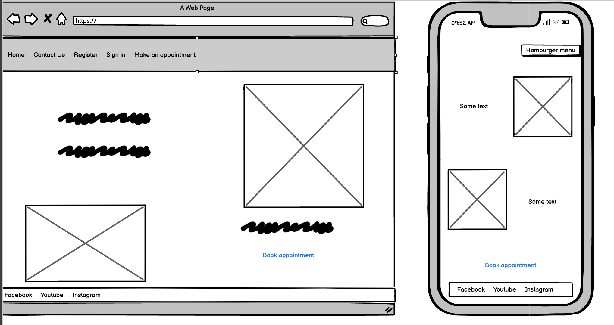

  - Contact Us
  
  
  - Make an appointment
  

  - Manage appointments
  

## Development

### Agile Methodology

This project was developed using the Agile methodology. All epics and user stories implementation progress was tracked through Github projects Kanban Board which can be found [here](https://github.com/users/d-lynch95/projects/3/views/1).

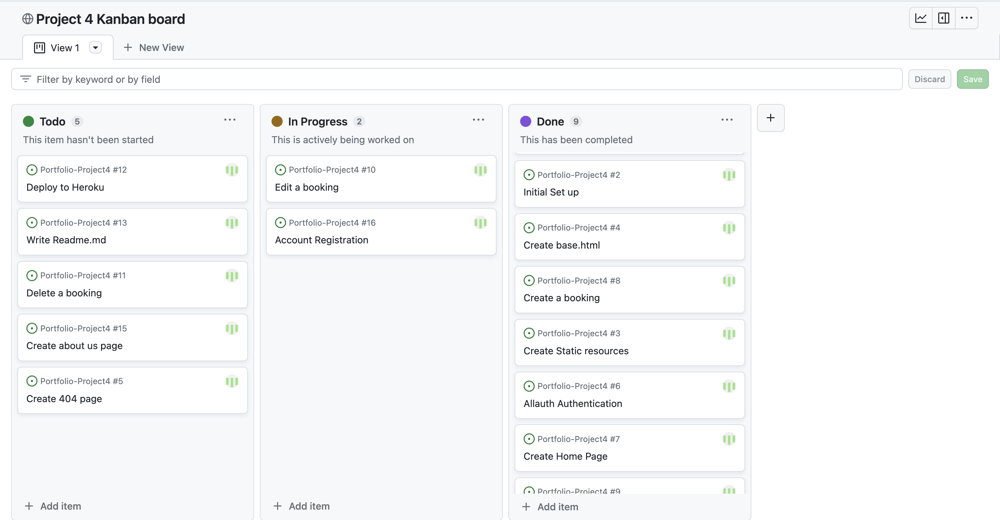

This project had 5 main epics (Milestones)

I. Epic 1. Initial Set up
  - As a developer, I need to create the base.html page and structure so that other pages can reuse the layout
  - As a developer, I need to create static resources so that images, css and javascript work on the website
  - As a developer, I need to set up the project so that it is ready for implementing the core features
  - As a developer, I need to create the footer with social media links and contact information
  - As a developer, I need to create the navbar so that users can navigate the website from any device

II. Epic 2.  USER REGISTRATION/AUTENTHICATION
  - As a developer, I need to implement the Register page using the django-allauth module
  - As a developer, I need to implement the Login page using django-allauth module
  - As a developer, I need to implement the  Logout modal using django-allauth module
  - As a site owner, I would like the allauth pages customized to that they fit in with the sites styling
    

III. Epic 3 - Making appointments
  - As a user, I would like to be able to create a new appointment when I want to visit the travel agnecy
  - As a user, I would like to view my bookings when I need to check the information
  - As a user, I would like to be able to edit a booking so that I can make changes when needed
  - As a user I would like to delete a booking when I no longer require it

IV. Epic 4 - Deployment Epic  
  - As a developer, I need to deploy the project to heroku so that it is live for users
	
V. Epic 5 - Documentation
  - Complete readme documentation

## Technologies used
- Python
  - The main language used in this project was python
- HTML
  - The website contains HTML
- CSS
  - The styling is done using CSS
- GitHub
  - The website is hosted on GitHub
- GitPod
  - The website was developed on GitPod
- Git
  - used to commit and push code during development
- Heroku
  - The website  is hosted on heroku
- Convertio.co
  - This site was used to convert jpg and png files to webp files
- Favicon.io
  - used for generating the website favicon
- Diffchecker 
  - used for comparing the code
- Font Awesome 
  - for creating atractive UX with icons
- Bootstrap5 
  - for adding predifined styled elements and creating responsiveness
- Google Fonts
  - for typography
- PEP8 Validator
  - used for validating the python code
- HTML - W3C HTML Validator
  - used for validating the HTML
- CSS - Jigsaw CSS Validator
  - used for validating the CSS
- Chrome Dev Tools
  - for debugging the project
- W.A.V.E
  - for testing accessibility
- Cloudinary 
  - for storing static data
- LightHouse 
  - for testing performance

## Features 

### Existing Features

- __Home Page__
  - This is the first page that the user will see when they arrive on the website. The primary goal of this page is to allow the user to understand the purpose of the website. This is achieved through eye catching imagery and concise text to explain how to use the website.

  - A  clear Navigation section also makes it intuitive for the user to navigate the website.

  - The footer section allows the user to view the company’s social media to understand better the company’s product offerings.

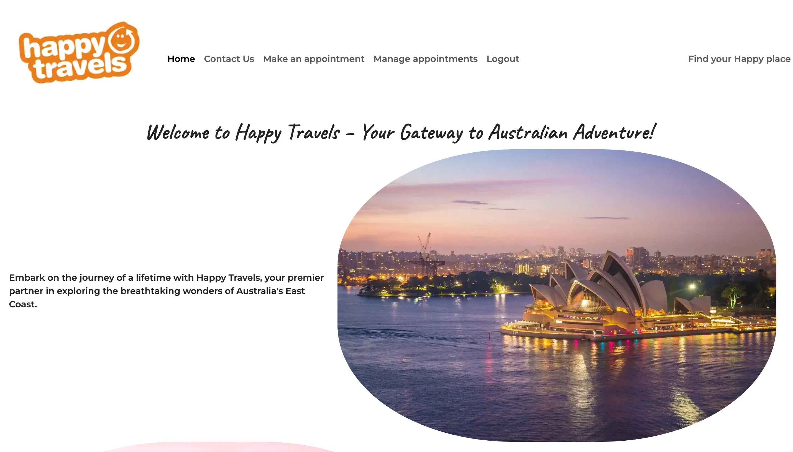

- __Contact Us Page__
  - The contact us section allows the users to contact the company directly if they have any issues. This adds to the user experience as the user may have some questions that they need answered before they are prepared to make an appointment. This allows the user to contact the company in person or online.

  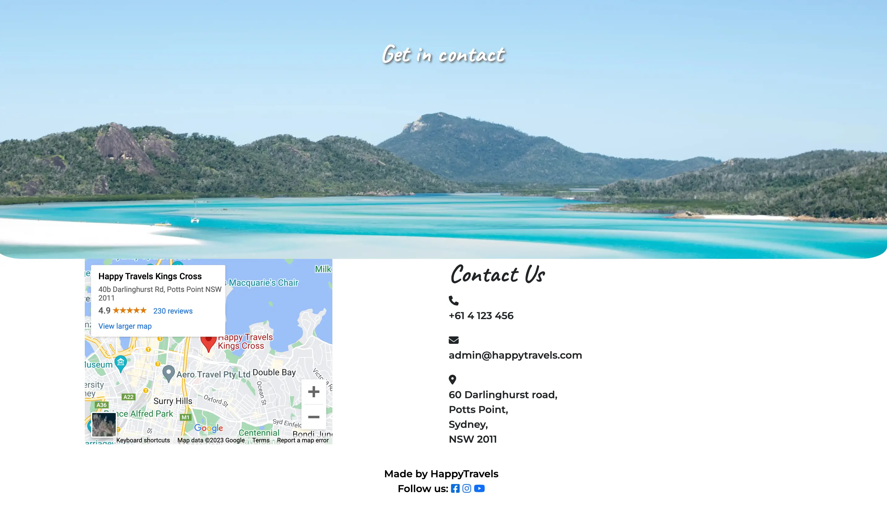

- __Make an appointment page__
  - The main purpose of the website  is for users  to make appointments in order to better plan their trip. This is easily done through the form on the “Make an appointment page”. 
  
  - If the user is logged in then they can instantly fill out the form to create the appointment. 
  
  - If the user is not logged in then they will be redirected to the log in or register account page. When the user has completed the form they are then redirected to the Manage appointments page

  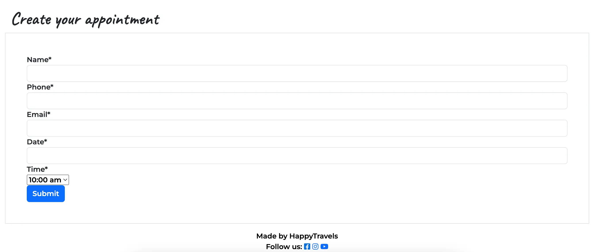

- __Manage appointments__
  - This page is only viewable if the user has logged in. 
  
  - On this page the user can view the appointments that they have already made. Users will also have the option to edit or delete any appointments they have made. 
  
  - If the user wishes to edit their appointment then they will be redirected to the form where their information will be autofilled and they can edit it as they need to. If the user chooses to delete their appointment then it will be removed from the database.

  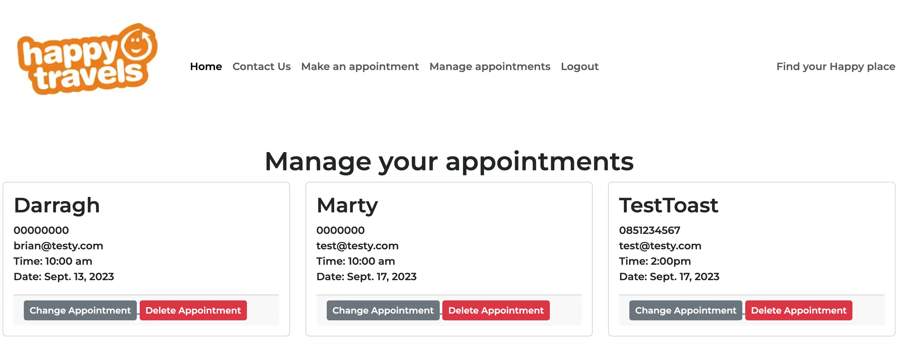

- __Navigation Menu__

- The Navigation contains links for Home, contact us, Make an appointment, Manage Appointments and has allauth options.

- The following navigation items are available on all pages:

  Home -> index.html - Visible to all

  Contact us -> contact.html - Visible to all

  Make an appointment -> form.html - Visible to logged in users

  Manage appointments ->posts.html - Visible to logged in users

  Logout -> logout.html - Visible to logged in users

  Login -> login.html - Visible to logged out users

  Register -> signup.html - Visible to logged out users

- __Favicon__

The favicon was created using the company logo. This favicon sits in the web browser tab and instantly allows the user to recognise the webpage. This adds to the customer experience.

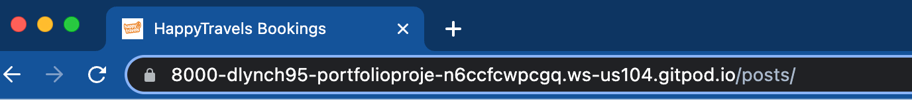

### Features Left to Implement

  -  I would like to add further email authentication
    - I would like to have users confirm their email addresses upon registration.

  - I would also like to implement user profiles. This would allow users to upload profile photos, include some information about themselves and also provide information about which services they are looking for.

## Testing 

I created an extra [Testing.md](https://github.com/d-lynch95/Portfolio-Project4/blob/main/Testing.md) page as the file was too large to fit in this README.

### BUGS
 - I encountered several bugs while creating this project.

- I faced bugs when creating the views and urls files when launching the project. This was resolved using advice from tutor support.

- I also faced issues with the urls.py files in both the project folder and the app folder. This was fixed by adding the path('', include('booking.urls')), line of code to the project urls.py file. 

- I faced issues when trying to include mixins to function based views. I fixed this by changing to class based views following the advice of a youtube tutorial.

- I was having issues with the formatting of some of the database fields once they had been formatted using summertime as the html tags were still showing. I changed this using {x.name|safe}

- When creating the URLS I had both functions and class based views pointing to the same URL's. This was causing issues with loading the page. Once this was corrected the issue resolved itself.

- I was having issues getting the database information to print to the desired webpage. This was due to using the incorrect naming convention on the for loop. Once I corrected the name to object_loop the page loaded correctly.

- I struggled with making the EditApptView work as planned. I spent a lot of time changing the views.py file, the urls.py file and even tried to adjust the model. Using the help of [this](https://forum.djangoproject.com/t/why-do-i-keep-getting-this-error-all-the-time-noreversematch-at/12520/2) forum I finally realised that the issue was with my link and that it didn't include a slug reference.

- I was having issues with my slug as I was using the self(slug.name) and this was causing issues as it was not a unique id and users could not make multiple appointments. I corrected this by adding a uuid to the django id and combining both the name and id fields in the slug

- I was having an issue as the slug was showing  on the form and accepting user input instead of autopopulating. I fixed this using a hiddenwidget which i found from the [DjangoProjects](https://docs.djangoproject.com/en/4.2/ref/forms/widgets/) website.

- I was having an issue with the user input field on the forms. This field was providing a drop down menu with all of the different registered users. I corrected this by removing the user input field from the form entirely. I then assigned the user in the form.is_valid section.

- I was having an issue that any logged in user could see all of the appointments that had been made. I fixed this by adding a get query set filter to the PostList view.

- I tried to change the time field in the model from a TimeField() to and integerFiled(). This was causing a lot of issues and I couldn't make any migrations to my models. I fixed this issue following the advice of tutor support and nuking my migrations. I deleted all of the migration files and pycache and then reset my database. This fixed the issue.

- I was having an issue displaying the string value of time on the appointments page. I solved this by changing the {{ post.time }} code to {{ post.get_time_display }}. This then shows the string value that correlates with the time selected.

- I was having issues with calling the time and date data to prevent double bookings. The code segment I was using was only calling the date data and not allowing any appointments to be made on the same days. I fixed this by adding the django Q to my code and combining time and date. This fixed the bug.

- I was having issues with loading my images to the heroku deployment site. I altered some of the settings in the settings.py file and then added a  tag on my index.html page and this fixed the issue.

- I was also having an issue with loading a background-image file in the css file as cloudinary would not work with the css. I opted to use an inline style instead for the hero image on the contact us page and this fixed the issue"

### User Testing

The application was tested on a macbook air using the google chrome browser.

I also tested it on the following mobile devices:
  OnePlus NordCE
  Iphone12
  Samsung Galaxy S
All of these devices worked as intended.

I did not test this site on a tablet but did utilise the google chrome Dev tools.

### Validator Testing 

- Python
  - No errors were found when passing through the [CI code linter](https://pep8ci.herokuapp.com/#)

  
See Linter results</sumary>

  
  

  
  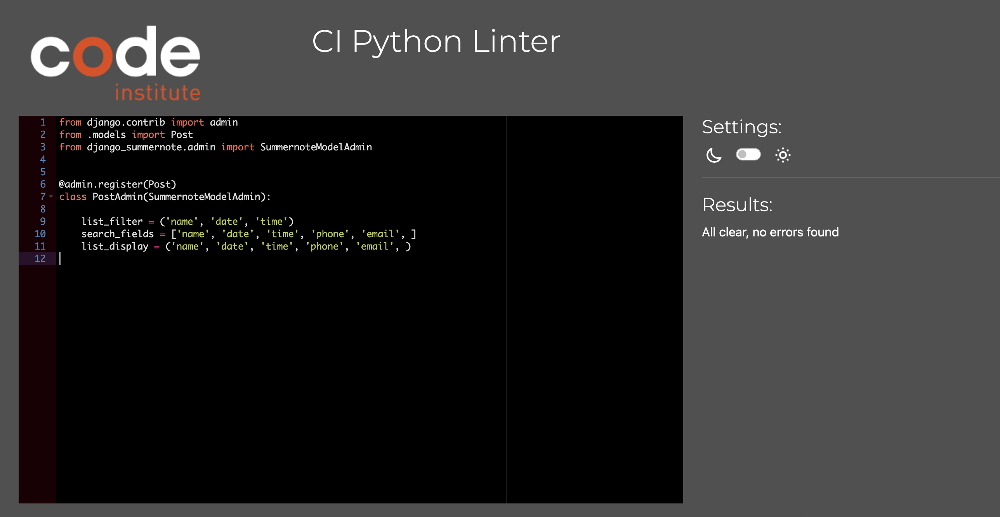

  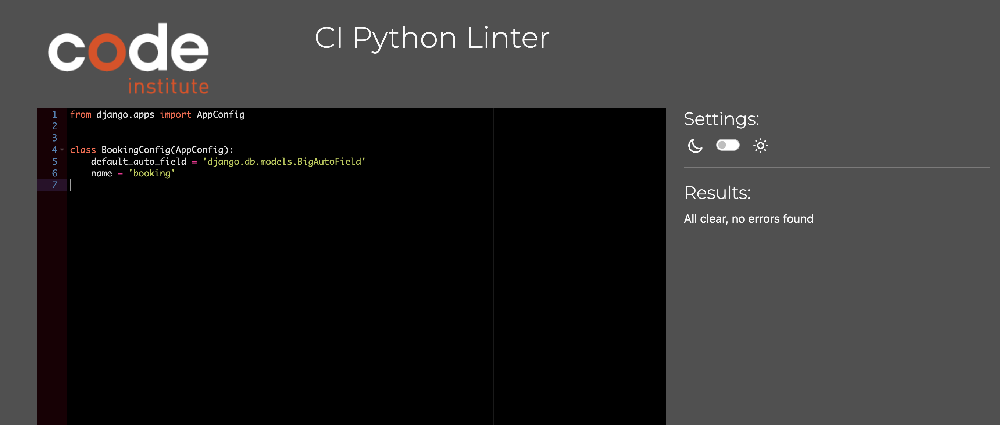

  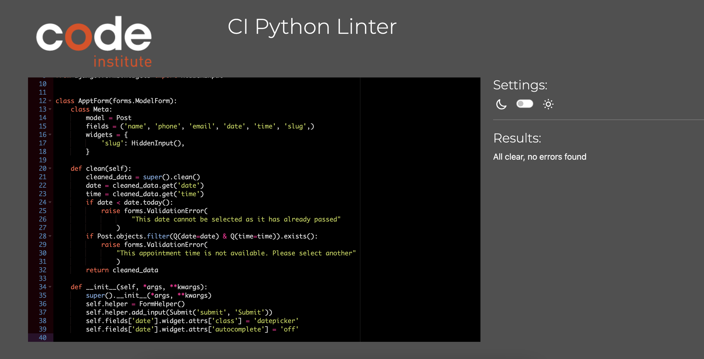

  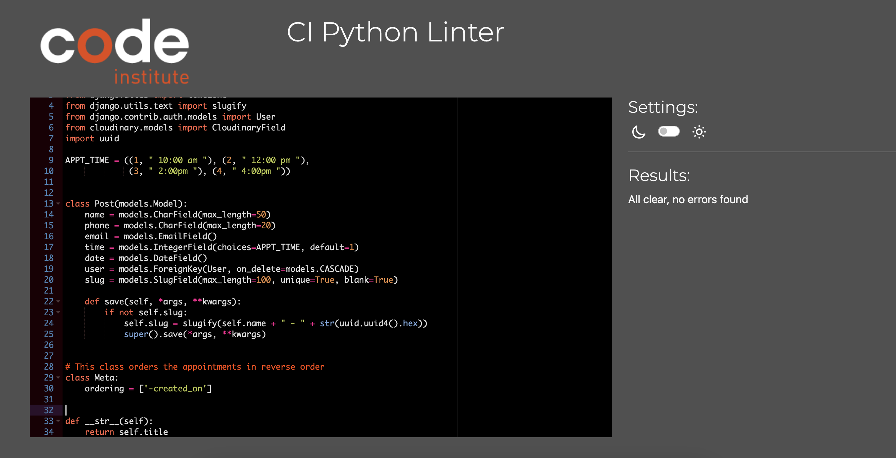

  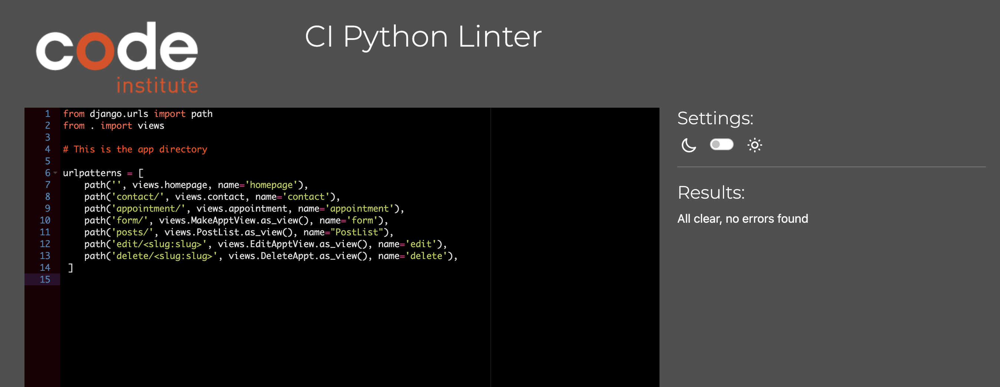

  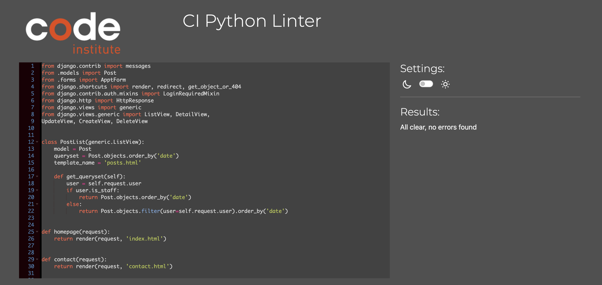

  

### Manual Testing

#### Functional Testing 
I created a seperate [Testing.md](https://github.com/d-lynch95/Portfolio-Project4/blob/main/Testing.md) file that outlines all of the tests completed

### Unfixed Bugs
 - There are no current bugs that we're aware of.

## Deployment

- The site was deployed to GitHub pages. The steps to deploy are as follows: 
  - In the GitHub repository, navigate to the Settings tab 
  - From the source section drop-down menu, select the Main Branch
  - Once the main branch has been selected, the page will be automatically refreshed with a detailed ribbon display to indicate the successful deployment. 

The live link can be found here - [Happy-Travels-Appt-Booking](https://happy-travels-appt-booking-469f488c0638.herokuapp.com/)

- Clone the Repository Code Locally
  - Navigate to the GitHub Repository you want to clone to use locally:

  - Click on the code drop down button
  - Click on HTTPS
  - Copy the repository link to the clipboard
  - Open your IDE of choice (git must be installed for the next steps)
  - Type git clone copied-git-url into the IDE terminal
  - The project will now of been cloned on your local machine for use.

- Fork the repository
  - For creating a copy of the repository on your account and change it without affecting the original project, useFork   directly from GitHub:

  - On My Repository Page, press Fork in the top right of the page
  - A forked version of my project will appear in your repository

- Heroku 
  - The project was deployed using Code Institutes mock terminal for Heroku

  - Deployment steps:

    - Fork or clone this repository.

    - Ensure the Profile is in place.

    - requirements.txt can be left empty as this project does not use any external libraries

    - Create a new app in Heroku

    - Select "New" and "Create new app"

    - Name the new app and click "Create new app"

    - In "Settings" select "BuildPack" and select Python and Node.js. (Python must be at the top of the list)

    - Whilst still in "Settings", click "Reveal Config Vars" and input the folloing. KEY: PORT, VALUE: 8000. Nothing else is needed here as this project does not have any sensitive files

    - Click on "Deploy" and select your deploy method and repository

    - Click "Connect" on selected repository.

    - Either choose "Enable Automatic Deploys" or "Deploy Branch" in the manual deploy section

    - Heroku will now deploy the site

## Credits 

### Content 

- The format and template for the README file was borrowed from the [Code institute](https://codeinstitute.net/ie/).

- The images were taken from [Pexels](https://www.pexels.com/) and [Unsplash](https://unsplash.com/)

- The image conversions from jpg to webp were done with [Convertio](https://convertio.co)

### Coding help

- The outline template for the Python was provided by the [Code Institiute](https://www.codeinstitute.com)

- The hero image code was taken from my [PP1](https://github.com/d-lynch95/Portfolio-1-GreatOceanRoadsters/blob/main/css/style.css)

- I also took a lot of inspiration from the Code institute I think Therefore I blog Walk through [Code Institiute](https://www.codeinstitute.com)

- A lot of the python coding was done with help from the tutorial pages at [w3schools](https://www.w3schools.com/)

- The Django documentation was one of the main resources I used during development [Django Documentation](https://docs.djangoproject.com/en/4.2/)

- The following YouTube videos were very useful in production [LearnDjangoin20minutes-TechWithTim](https://www.youtube.com/watch?v=nGIg40xs9e4&t=2s), [PythonDjangoDentistWebsite](https://www.youtube.com/@Codemycom), [BuildADoctorWebsiteWithDjango](https://www.youtube.com/watch?v=3_3q_dE4_qs), [HowToCreateABookingSystemForAHealthClinic](https://www.youtube.com/watch?v=s5xbtuo9pR0), I also used the follow along blog [HowToCreateABookingSystemForAHealthClinic](https://blog.devgenius.io/django-tutorial-on-how-to-create-a-booking-system-for-a-health-clinic-9b1920fc2b78)

- The code for the form came from the following repository [DentistGitHub](https://github.com/flatplanet/dentistDjango/blob/master/website/templates/home.html). This was the repository [PythonDjangoDentistWebsite](https://www.youtube.com/watch?v=rHZwE1AK1h8&list=PLCC34OHNcOtrZnQI6ZLvGPUWfQ6oh-D6H&index=11)

- I followed the guidance of [this](https://www.youtube.com/watch?v=RwWhQTSV44Q) youtube tutorial to help create the crud functionality for my website

- The tutor support team from codeinstitute were extremely helpful in helping me to overcome bugs in my code.

- I used countless stack overflow entries to help me to solve minor django related bugs.

- I used the following projects as inspiration for my project. [SizzleAndSteak](https://github.com/Gareth-McGirr/Portfolio-Project-4-SizzleAndSteak), [TennisBuddies](https://github.com/lucia2007/tennis_buddies), [BurgerBar](https://github.com/LADCode2021/pp4-burger-bar), [Itallianisimo](https://github.com/useriasminna/italianissimo-booking-website), [KiwiPiano](https://github.com/VeronicaLourens/kiwipiano)

- I used the following tutorial for help with my requirements.txt file [LearnPython](https://learnpython.com/blog/python-requirements-file/)

 - I also received help from the following slack users for minor bugs or style changes inc21, Tatiana Ruffo, Dave T, Laura, Jo_ci and I received a lot of help and advice from my mentor Gareth McGirr and from Paul Thomas our cohort leader.
